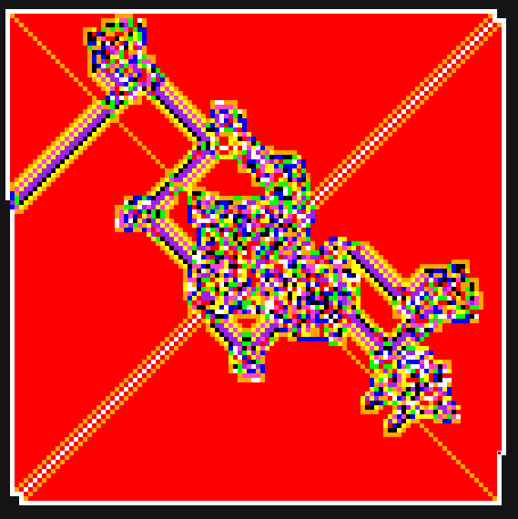
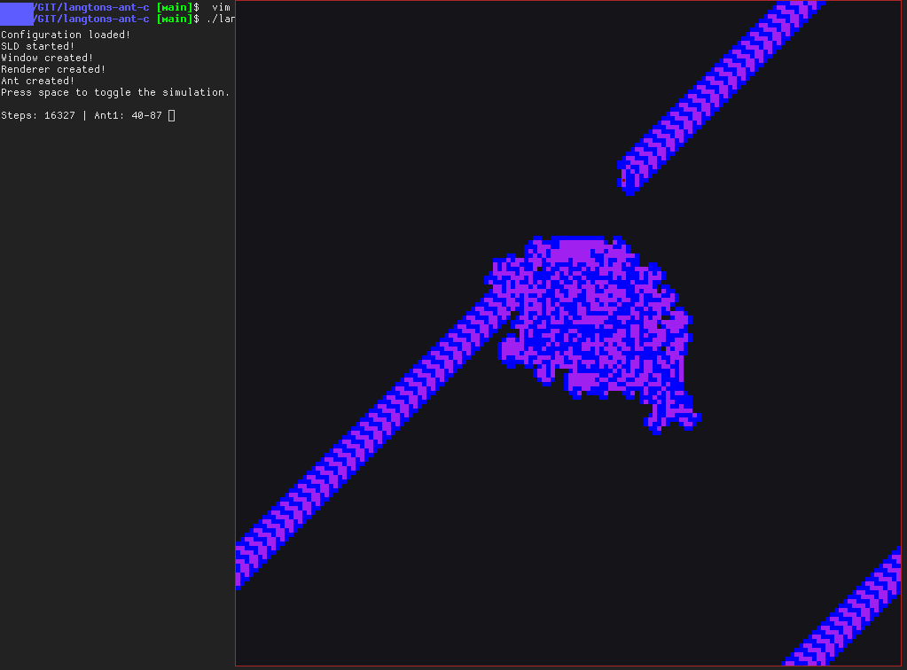
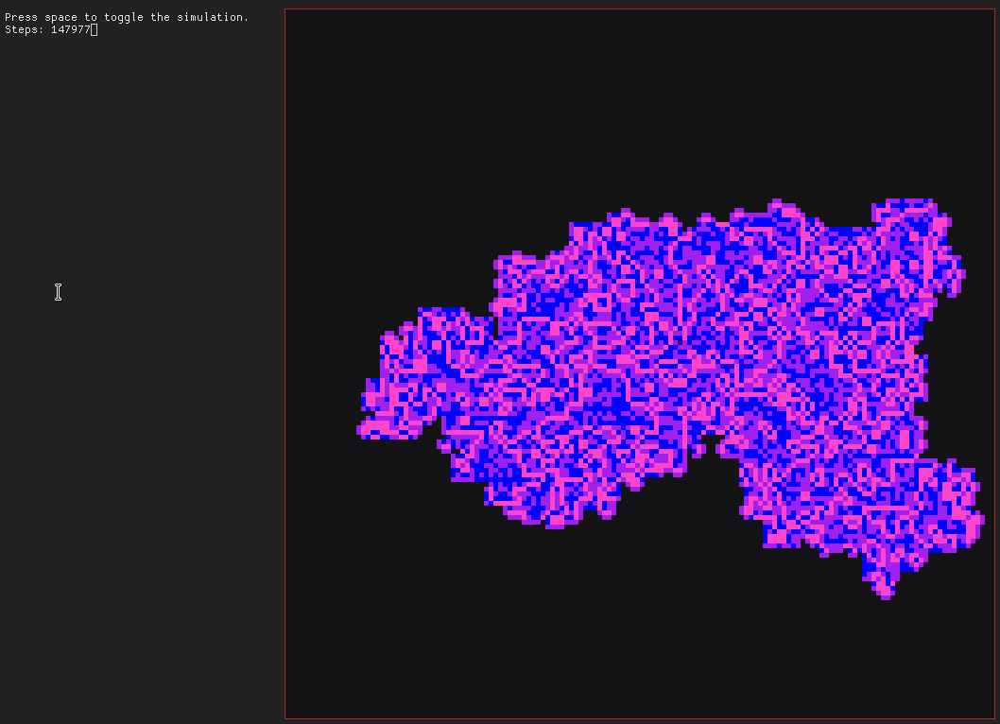

<div align=center>
  <h1>Langtons ant</h1>
  <b>Langtons ant simulation made in C using SDL2.</b><br>
  Based on <a href="https://github.com/r4v10l1/LangtonsAnt">r4v10l1/LangtonsAnt</a>.
</div>

# Table of contents
1. [Description](#Description)
2. [Keys](#Keys)
3. [Possible settings](#Possible-settings)
    - [General](#General)
    - [Colors](#Colors)
    - [Color list](#Possible-colors)
4. [TODO](#TODO)
5. [Screenshots](#Screenshots)

## Description
The program creates a window with SDL2 and renders the langtons ant in real time.

## Keys
Key                     | Description
------------------------|------------------------
<kbd>Esc</kbd>          | Exit the program
<kbd>Space</kbd>        | **Toggle** the simulation
<kbd>Right Arrow</kbd>  | Step the simulation
<kbd>G</kbd>            | Toggle grid

## Possible settings
Can be edited in `config.cfg`

### General
Setting         | Description                                                                | Default value
----------------|----------------------------------------------------------------------------|----------------
`WINDOW_W`      | Window width                                                               | 1200
`WINDOW_H`      | Window height                                                              | 750
`CELL_SIZE`     | Cell size in pixels make sure WINDOW_W and WINDOW_H can be divided by it   | 10
`FPS`           | Frames per seccond when space is not pressed                               | 750
`DELAY`         | Time that the program will wait when holding the space (ms)                | 50
`VERBOSE`       | Also `DEBUG_PRINT`. Verbose level. Check verbose levels for more info      | 1

#### Verbose levels
Verbose | Description
--------|--------------------------------------------------------------------------------
`0`     | Nothing will be printed
`1`     | Steps and basic information will be printed
`2`     | Information about the program's state, and the ants position will be printed
`3`     | A lot of information like the array state will be printed

### Colors
Setting         | Description                                                     | Default value
----------------|-----------------------------------------------------------------|----------------
`COLOR_NUMBER`  | Number of color asociations that the program will use (Max 9)   | 2
`BACKGROUND_R`  | Red value used for the background                               | 20
`BACKGROUND_G`  | Green value used for the background                             | 20
`BACKGROUND_B`  | Blue value used for the background                              | 22
`GRID_COLOR`    | Color of the grid if active. RGB (Grayscale)                    | 40

### Possible rotations
Number | Constant name | Description
-------|---------------|----------------------
`0`    | `CW`          | Rotate right (*ClockWise*)
`1`    | `CCW`         | Rotate left (*CounterClockWise*)
`2`    | `U_TURN`      | Invert rotation
`3`    | `NO_ROTATION` | Don't change the rotation

*Keep in mind that constant names are only used in the code and can't be used as values for the configuration file.*

```cfg
# Will rotate right on the color on position 0, left on the color 1 and 3,
# will invert the rotation on color 2, and will not turn on color 4. 
rotation_0 = 0
rotation_1 = 1
rotation_2 = 2
rotation_3 = 1
rotation_4 = 3
...
```

### Possible colors
Possible colors for the configuration file.

Each color will replace the last one (2 will replace 1; 1 will replace 0...).
The first one (0) will replace the last one, wich is determined by `COLOR_NUMBER`.

Example:

```cfg
color_0 = 1             # Will set color 0 (FIRST) to Black. Will replace the last one (delends on COLOR_NUMBER).
color_1 = 3             # Will set color 1 (SECCOND) to Red. Will replace Black.
color_3 = 5             # Will set color 3 to Yellow. Will replace Red.
```

Code  | Color       | RGB value
------|-------------|-------------
**1** | Black       | (0,0,0)
**2** | White       | (255,255,255)
**3** | Red         | (255,0,0)
**4** | Orange      | (255,165,0)
**5** | Yellow      | (255,255,0)
**6** | Green       | (0,255,0)
**7** | Blue        | (0,0,255)
**8** | Purple      | (160,32,240)
**9** | Pink        | (255,68,204)

## TODO
- [ ] Multiple ants with Mouse1
- [X] Make the ant go to the other side of the window when reaching a border instead of killing it
- [ ] Kill the ant when 2 are in the same position
- [ ] Be able to save the state of the cells
- [X] Reduce size of switches
- [X] Add more than 2 rotations (Now 4)
- [ ] Change `read_config.h` so you can use more than 9 colors / color positions
- [ ] Read `colors.cfg` (For example) to change the colors instead of function in the code.

## Screenshots



